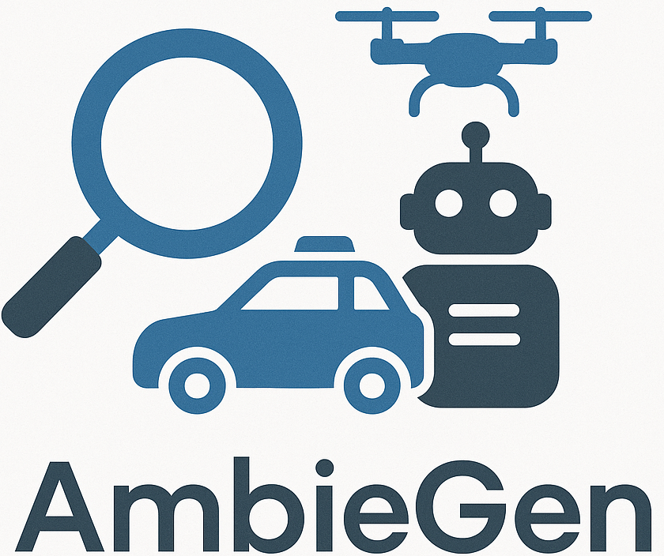

# AmbieGen
<p align="center">
  
</p>
**AmbieGen** is a flexible and modular framework for **automated scenario-based testing** of autonomous robotic systems. It leverages **evolutionary search algorithms** to generate and evolve test scenarios that expose weaknesses and critical failures in the system under test.

Built on top of the [pymoo](https://pymoo.org/) multi-objective optimization library, AmbieGen provides a foundation for **customizable and extensible test generation workflows**, enabling researchers and developers to plug in their own test generators, search operators, and fitness functions with minimal effort.

---

## 🔍 Key Advantages

- **Modular Architecture**  
  Every component—from the system under test to the test case generator and mutation operators—is fully modular, making it easy to integrate new algorithms or extend existing ones.

- **Flexible Configuration**  
  Users can configure their own test generators, mutation and crossover strategies, evaluation metrics, and search techniques, tailoring the framework to their specific application domain.

- **Based on Pymoo**  
  The framework is built on `pymoo`, a widely-used library for evolutionary optimization, enabling fast integration of multi-objective and advanced search strategies.

---

## 🚀 Features

- **Behavior-based scenario generation**  
  Generate complex scenarios by composing high-level agent behaviors (e.g., lane changing, obstacle avoidance, adversarial behavior).

- **Evaluation of autonomous decision-making**  
  Automatically identify edge cases and failure-inducing situations by analyzing agent behavior across test runs.

- **Support for multiple domains**  
  Test case generation currently supports:
  - Autonomous mobile robots
  - Lane Keeping Assist Systems (LKAS) in autonomous vehicles

- **Custom Search Operators**  
  Easily implement your own mutation, crossover, or sampling strategies to guide the search more effectively.

- **Extensible Evaluation**  
  Plug in your own scoring and fitness evaluation logic, such as safety violations, control errors, or collision metrics.

---

## 📖 Citation
If you use AmbieGen in your research, please cite the following paper:

```
@article{HUMENIUK2023102990,
title = {AmbieGen: A search-based framework for autonomous systems testingImage 1},
journal = {Science of Computer Programming},
volume = {230},
pages = {102990},
year = {2023},
issn = {0167-6423},
doi = {https://doi.org/10.1016/j.scico.2023.102990},
url = {https://www.sciencedirect.com/science/article/pii/S0167642323000722},
author = {Dmytro Humeniuk and Foutse Khomh and Giuliano Antoniol},
keywords = {Evolutionary search, Autonomous systems, Self driving cars, Autonomous robots, Neural network testing},
}
```

# Getting Started

## Installation

Clone the repository and install dependencies:

```python
git clone git@github.com:swat-lab-optimization/ambiegen.git
cd ambiegen
conda create -n ambiegen python=3.10
conda activate ambiegen
pip install -r requirements.txt
```

## Usage

### Generating Tests

Run the following to command to generate tests based on the default configuration:

```bash
python generate_tests.py --module-name "ambiegen.testers.uav_tester" --class-name "UAVTester" --runs 3 --config-path "tester_config.yaml"
```

### Comparing Outputs

Use the `compare.py` script to compare results:

```bash
python compare.py  --stats_path "path-to-alg1-stats" "path-to-alg2-stats" --stats_names "alg1" "alg2" --plot_name "my_experiment"
```